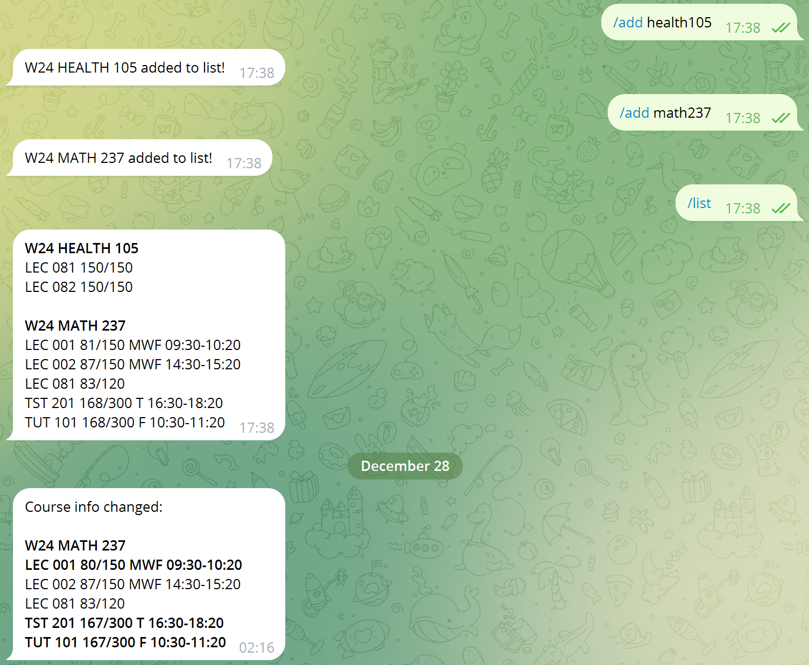

# UW Course Monitor Bot
A Telegram bot that monitors course schedules for changes in enrolment numbers.

You need to host your own instance of this bot to use it.

Supported commands:
- `/list` - List courses being monitored
- `/add` - Add course to list
- `/remove` - Remove course from list
- `/clear` - Clear list

The bot sends a notification on any change to course schedules.



## Installation
Requirements: Python 3.9+

Create a `.env` file:
```text
BOT_TOKEN=???
USER_ID=???
UW_API_KEY=???
```
- `BOT_TOKEN` is a Telegram bot token obtained from [@BotFather](https://t.me/BotFather).
- `USER_ID` is your Telegram user ID. The bot will only work in your DMs.
- `UW_API_KEY` is a [UWaterloo Open Data API key](https://uwaterloo.atlassian.net/wiki/spaces/UWAPI/pages/34025641600/Getting+Started+-+OpenAPI).

Then:
```commandline
pip install -r requirements.txt
python main.py
```
